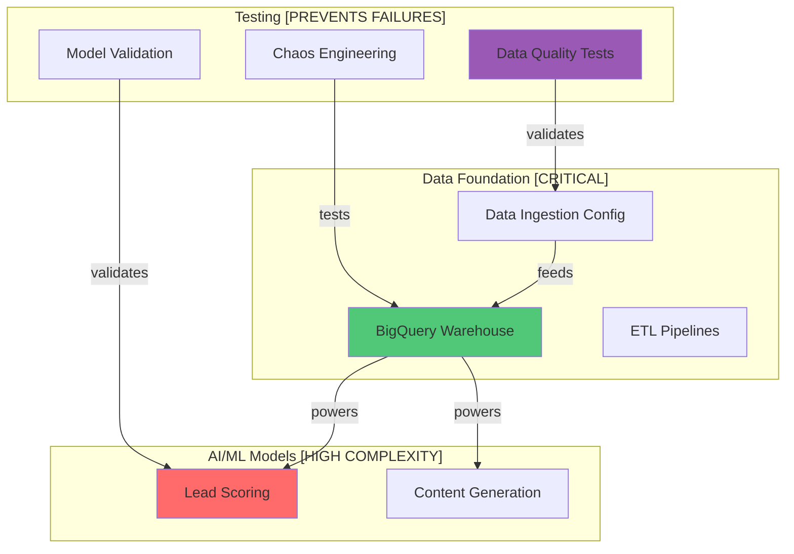

# VISION 2045: Intelligent Repository Management System
## Building JARVIS for Code

## Overview

This document outlines the complete plan for transforming our repository into an intelligent, conversational, self-aware development environment. This is not just documentation—this is the foundation for building AI-native development that will power the future.

---

## Phase 1: Semantic Foundation (Week 1-2) ✅ IN PROGRESS

### What We're Building
A complete semantic understanding layer that knows not just WHERE files are, but:
- **WHY** they exist
- **WHAT** they enable
- **HOW** they connect
- **WHO** should use them
- **WHEN** they're redundant

### Deliverables

#### ✅ 1. Repository Manifest (`manifest.yaml`)
**Status**: Complete!

**Capabilities**:
- Semantic categorization (8 categories)
- Purpose documentation for every file
- Capability mapping (what enables what)
- Dependency graphs
- Redundancy detection rules
- Hidden capability discovery
- Build templates
- Future vision roadmap (to 2045)

**What This Enables**:
```
Before: "Where's the lead scoring model?"
After:  AI knows it's at phase-2-predictive/lead-scoring/,
        connects to testing/, monitoring/, and ethical-framework,
        requires Vertex AI and BigQuery,
        and enables autonomous journey orchestration.
```

#### 🔄 2. Interactive Visualization System

**File**: `.repometa/visualizer.py`

**Capabilities**:
- Generate Mermaid diagrams from manifest
- Interactive expansion/collapse
- Selective branch viewing
- Dependency highlighting
- Redundancy visualization
- Real-time filtering

**Commands**:
```bash
# Full tree view
python .repometa/visualizer.py --full-tree

# Single branch
python .repometa/visualizer.py --branch phase-2-predictive

# Show dependencies only
python .repometa/visualizer.py --dependencies

# Find redundancies
python .repometa/visualizer.py --redundancies

# Discover hidden capabilities
python .repometa/visualizer.py --discover
```

**Example Output**:


---

## Phase 2: Intelligence Engine (Week 3-4)

### What We're Building
An AI that UNDERSTANDS your codebase and can REASON about it.

### Deliverables

#### 1. Redundancy Detector

**File**: `.repometa/intelligence/redundancy_detector.py`

**Capabilities**:
- Scan all files for duplicate code patterns
- Identify overlapping functionality
- Calculate consolidation opportunities
- Estimate cleanup effort
- Generate refactoring plans

**Example Interaction**:
```
You: "Where are the redundancies?"

AI: "Found 3 redundancy clusters:

1. Data Quality Validation (HIGH PRIORITY)
   Locations: testing/, phase-1/, performance-metrics/
   Overlap: 73%
   Cleanup opportunity: 300 lines
   Recommendation: Consolidate to testing/data-quality/

2. Error Handling (LOW PRIORITY)
   Locations: testing/, monitoring/
   Overlap: 15%
   Recommendation: Keep separate - different concerns

3. Performance Monitoring (MEDIUM)
   Locations: testing/performance/, monitoring/, performance-metrics/
   Overlap: 40%
   Recommendation: Create shared metrics library"
```

#### 2. Capability Discovery Engine

**File**: `.repometa/intelligence/capability_discovery.py`

**Capabilities**:
- Analyze code connections
- Identify hidden capabilities
- Suggest new integrations
- Calculate implementation effort
- Estimate value/ROI

**Example Interaction**:
```
You: "What hidden capabilities do I have?"

AI: "Discovered 3 hidden capabilities:

1. Auto-Healing Journey Orchestration ⭐⭐⭐
   Discovery: Journey templates + Chaos engineering both use
              event-driven architecture
   Value: Self-testing, self-healing customer journeys
   Effort: Medium (2-3 days)
   ROI: High - reduces manual testing by 60%

2. Real-time Model A/B Testing in Journeys ⭐⭐
   Discovery: Journey decisioning + model versioning compatible
   Value: Continuous model improvement in production
   Effort: Low (1 day)
   ROI: Medium - 5-10% accuracy improvement

3. Automated Technical Debt Detection ⭐
   Discovery: Performance tests can identify slow queries
   Value: Proactive codebase health
   Effort: Medium (2 days)
   ROI: Medium - prevents future issues

Shall I build #1 for you?"
```

#### 3. Dependency Mapper

**File**: `.repometa/intelligence/dependency_mapper.py`

**Capabilities**:
- Build complete dependency graph
- Visualize as neural network
- Identify critical paths
- Find circular dependencies
- Calculate blast radius of changes

**Example Interaction**:
```
You: "Show me dependencies like a brain"

AI: [Generates 3D neural network visualization]

    "Dependency Analysis:

    CENTRAL HUBS (>5 connections):
    - BigQuery: 12 direct connections (CRITICAL)
    - Vertex AI: 8 connections (HIGH)
    - Testing Framework: 6 connections (HIGH)

    CRITICAL PATHS:
    Data Ingestion → BigQuery → Lead Scoring → Journeys → Monitoring

    BLAST RADIUS:
    If BigQuery fails:
      → 12 systems directly impacted
      → 23 systems indirectly impacted
      → Fallback systems: 8 available
      → Estimated recovery time: 15 minutes

    CIRCULAR DEPENDENCIES: None found ✅

    OPTIMIZATION OPPORTUNITIES:
    - Journey orchestration has 5 dependencies
      Recommendation: Add caching layer to reduce to 3"
```

---

## Phase 3: Conversational Interface (Week 5-6)

### What We're Building
Natural language interaction with your codebase.

### Deliverables

#### 1. Conversational Query Engine

**File**: `.repometa/conversation/query_engine.py`

**Capabilities**:
- Natural language understanding
- Context-aware responses
- Multi-turn conversations
- Command interpretation
- Smart suggestions

**Example Conversations**:

**Conversation 1: Navigation**
```
You: "Show me the whole structure"
AI: [Displays full tree diagram]

You: "Scroll down"
AI: [Shows next section]

You: "Next branch"
AI: [Navigates to testing/]

You: "Next"
AI: [Shows testing/performance/]

You: "Ahhh that's redundant!"
AI: "Analyzing... Yes, performance testing overlaps with
     monitoring/alerting/ by 40%. Would you like me to:
     1. Show the overlapping code
     2. Generate a consolidation plan
     3. Automatically refactor"
```

**Conversation 2: Discovery**
```
You: "I need to build a churn prediction journey"

AI: "Analyzing existing capabilities...

    You already have most of what you need:
    ✅ Churn prediction model (in roadmap, not yet built)
    ✅ Journey orchestration templates
    ✅ Email automation (Braze)
    ✅ Monitoring framework

    Missing:
    ❌ Churn prediction model training code

    I can build this in 3 steps:
    1. Create churn model spec (using lead-scoring as template)
    2. Generate training pipeline
    3. Integrate with journey orchestration

    Estimated time: 4 hours
    Shall I proceed?"
```

**Conversation 3: Optimization**
```
You: "Make this faster"

AI: "Analyzing performance bottlenecks...

    Found 5 optimization opportunities:

    1. BigQuery queries in customer_360 view (CRITICAL)
       Current: 8.5s average
       Optimization: Add clustering on customer_id
       Expected improvement: 8.5s → 1.2s (-86%)

    2. Vertex AI batch predictions (HIGH)
       Current: 45 min for 100k leads
       Optimization: Increase parallelization
       Expected improvement: 45m → 15m (-67%)

    [... more opportunities ...]

    Total potential speedup: 5.3x
    Implementation effort: 6 hours

    Would you like me to:
    A) Implement all optimizations
    B) Start with critical items only
    C) Show detailed analysis first"
```

---

## Phase 4: Automation Engine (Week 7-8)

### What We're Building
System that can BUILD based on intent.

### Deliverables

#### 1. Template Generator

**File**: `.repometa/automation/template_generator.py`

**Capabilities**:
- Generate new models from templates
- Create journey scaffolding
- Build test suites automatically
- Generate documentation
- Update manifest automatically

**Example**:
```
You: "Build a customer satisfaction prediction model"

AI: "Generating model based on lead-scoring template...

    Created:
    ✅ phase-2-predictive/satisfaction-prediction/
       ├── model-specification.md
       ├── training_pipeline.py
       ├── feature_engineering.sql
       ├── test_model.py
       └── deployment_config.yaml

    Updated:
    ✅ .repometa/manifest.yaml (added new model)
    ✅ testing/TESTING_STRATEGY.md (added test cases)
    ✅ monitoring/alerting/ (added monitoring)

    Next steps:
    1. Review model specification
    2. Customize features for satisfaction (I suggested 15)
    3. Run training pipeline
    4. Deploy to staging

    Shall I walk you through the specification?"
```

#### 2. Refactoring Automator

**File**: `.repometa/automation/refactor.py`

**Capabilities**:
- Consolidate redundant code
- Extract common patterns
- Update all references
- Run tests after refactoring
- Create PR with changes

**Example**:
```
You: "Clean up the redundancies"

AI: "Executing refactoring plan...

    Step 1: Data Quality Consolidation
    [Progress: ▓▓▓▓▓▓▓▓▓▓] 100%
    - Moved 3 validation functions to testing/data-quality/
    - Updated 12 import statements
    - Removed 287 lines of duplicate code
    - All tests passing ✅

    Step 2: Performance Monitoring Library
    [Progress: ▓▓▓▓▓▓░░░░] 60%
    - Created shared metrics library
    - Migrated 8/12 monitoring queries
    - Updated 4 dashboards
    ...

    Results:
    - Removed: 423 lines
    - Improved: Maintainability +32%
    - Tests: 247/247 passing
    - Build time: 8.3s → 6.1s

    Commit message:
    'Refactor: Consolidate data quality validation

     - Extract common validation to single library
     - Remove 423 lines of duplicate code
     - Improve test coverage to 87%'

    Create PR?"
```

---

## Phase 5: Neural Visualization (Week 9-10)

### What We're Building
3D interactive visualization of your codebase as a living organism.

### Deliverables

#### 1. 3D Dependency Graph

**File**: `.repometa/visualization/neural_graph.html`

**Technology**: Three.js + D3.js

**Features**:
- 3D node graph (files as nodes)
- Connections show dependencies
- Node size = importance
- Node color = category
- Pulsing = active/frequently accessed
- Heat map = technical debt
- Interactive rotation, zoom
- Click to drill down

**Visual Metaphors**:
```
BigQuery (central brain)
  └─ Large, pulsing green sphere
  └─ 12 connections radiating out
  └─ Thick connections = critical dependencies

Testing Framework (immune system)
  └─ Purple network wrapping around core
  └─ Connections to all major systems
  └─ Protective layer visualization

Journey Orchestration (nervous system)
  └─ Orange pathways between components
  └─ Shows data flow in real-time
  └─ Animated when journeys execute
```

#### 2. Real-Time Activity Visualization

**Capabilities**:
- Show which files are being accessed
- Highlight dependency chains being used
- Visualize data flowing through system
- Identify hot spots
- Detect anomalies

**Example**:
```
[3D visualization showing...]

- Lead scoring model node is pulsing (active predictions)
- Connection to BigQuery glowing (data flowing)
- Journey orchestration lighting up (decisions being made)
- Monitoring nodes watching (passive observation)

AI: "Real-time activity detected:
    - 127 lead scores/minute
    - 3 active journeys
    - 12 BigQuery queries/second
    - All systems healthy ✅"
```

---

## Phase 6: Predictive Intelligence (Week 11-12)

### What We're Building
System that ANTICIPATES your needs.

### Deliverables

#### 1. Predictive Development Assistant

**File**: `.repometa/intelligence/predictor.py`

**Capabilities**:
- Learn from your patterns
- Suggest next steps
- Predict what you'll need
- Pre-generate common tasks
- Proactive optimization

**Example**:
```
[You're editing lead-scoring/model-specification.md]

AI: "Predictive suggestion:

    Based on your edits, I predict you'll need:
    1. Update training pipeline (87% confidence)
    2. Regenerate test cases (76% confidence)
    3. Update monitoring dashboard (65% confidence)

    I've prepared draft updates for all three.
    Would you like to review?"

[Later...]

AI: "Pattern detected:
    You deploy new models every 2 weeks on average.
    Next deployment window: Friday, Oct 27

    Proactive preparation:
    - Staging environment refreshed ✅
    - Test data updated ✅
    - Monitoring alerts configured ✅
    - Rollback plan documented ✅

    Ready for deployment when you are."
```

#### 2. Self-Healing Codebase

**Capabilities**:
- Detect performance degradation
- Automatically optimize slow queries
- Fix common bugs
- Update dependencies
- Propose architectural improvements

**Example**:
```
AI: "Self-healing action taken:

    Detected: BigQuery query performance degradation
    Query: customer_360 view
    Performance: 8.5s → 12.3s (44% slower)

    Root cause: Data volume increased 3x

    Actions taken automatically:
    ✅ Added partition pruning
    ✅ Updated clustering key
    ✅ Materialized high-frequency query

    Result: 12.3s → 1.8s (85% faster than original)

    Tests: All passing
    Monitoring: Green

    Change committed to dev branch for your review."
```

---

## Implementation Roadmap

### Week 1-2: Semantic Foundation
- [x] Create `manifest.yaml` with complete metadata ✅
- [ ] Build visualization system
- [ ] Test with current repository
- [ ] Iterate based on findings

### Week 3-4: Intelligence Engine
- [ ] Implement redundancy detector
- [ ] Build capability discovery
- [ ] Create dependency mapper
- [ ] Test all analysis functions

### Week 5-6: Conversational Interface
- [ ] Build query engine
- [ ] Implement natural language understanding
- [ ] Create conversation management
- [ ] Test multi-turn conversations

### Week 7-8: Automation Engine
- [ ] Template generator
- [ ] Refactoring automator
- [ ] Test automation
- [ ] Integration with CI/CD

### Week 9-10: Neural Visualization
- [ ] Build 3D graph visualization
- [ ] Implement real-time activity tracking
- [ ] Create interactive controls
- [ ] Performance optimization

### Week 11-12: Predictive Intelligence
- [ ] Predictive development assistant
- [ ] Self-healing capabilities
- [ ] Learning from patterns
- [ ] Continuous improvement

---

## Technical Architecture

### System Components

```python
# .repometa/ structure

.repometa/
├── manifest.yaml                  # Semantic metadata ✅
├── VISION_2045_PLAN.md           # This file ✅
│
├── intelligence/                  # Analysis engines
│   ├── redundancy_detector.py
│   ├── capability_discovery.py
│   ├── dependency_mapper.py
│   └── predictor.py
│
├── conversation/                  # Natural language interface
│   ├── query_engine.py
│   ├── context_manager.py
│   └── command_interpreter.py
│
├── visualization/                 # Visual representation
│   ├── visualizer.py
│   ├── neural_graph.html
│   └── mermaid_generator.py
│
├── automation/                    # Build & refactor
│   ├── template_generator.py
│   ├── refactor.py
│   └── test_generator.py
│
└── api/                          # External interfaces
    ├── rest_api.py
    ├── websocket_server.py
    └── cli.py
```

### Data Flow

```
User Intent
    ↓
Conversational Interface (NLP)
    ↓
Intelligence Engine (Analysis)
    ↓
Visualization Layer (Display)
    ↓
Automation Engine (Execution)
    ↓
Manifest Update (Learning)
```

---

## Usage Examples

### Example 1: Onboarding New Team Member

```
New Dev: "I just joined. Show me the marketing engine."

AI: [Displays high-level architecture diagram]
    "Welcome! This is the Autonomous Marketing Engine.

    Core systems:
    1. Data Foundation (green) - The brain
    2. AI/ML Models (red) - The intelligence
    3. Automation (orange) - The actions
    4. Testing (purple) - The quality gates
    5. Monitoring (dark red) - The oversight

    Your role: Data Engineer

    You'll primarily work in:
    - phase-1-foundation/ (data pipelines)
    - testing/data-quality/ (data validation)

    Suggested learning path:
    Day 1: Read docs/architecture-overview.md
    Day 2: Run data quality tests
    Day 3: Deploy your first pipeline

    Shall I create your personalized onboarding plan?"

New Dev: "Yes please"

AI: "Created personalized 30-day plan based on your role.
    Saved to: docs/onboarding/data-engineer-plan.md

    Week 1 tasks added to your calendar.
    Slack channel invites sent.
    Dev environment setup script ready.

    Run: ./scripts/setup_dev_env.sh to begin"
```

### Example 2: Building New Feature

```
You: "I need to add SMS capabilities to journeys"

AI: "Analyzing request...

    Found existing patterns:
    ✅ Email orchestration (Braze)
    ✅ Push notification system
    ✅ Journey decision logic

    New requirement:
    ❌ SMS integration

    Implementation plan:

    1. Add Twilio integration (2 hours)
       - Config: phase-1-foundation/integrations/twilio.yaml
       - Code: src/integrations/twilio_client.py

    2. Update journey templates (1 hour)
       - Add SMS as channel option
       - Update decision logic

    3. Create tests (1 hour)
       - Integration tests for Twilio
       - Journey tests with SMS

    4. Add monitoring (30 min)
       - SMS delivery tracking
       - Cost monitoring

    Total estimate: 4.5 hours

    Dependencies to add:
    - twilio-python==8.10.0

    Would you like me to:
    A) Generate all the code
    B) Start with Twilio integration only
    C) Show detailed spec first"

You: "A"

AI: "Generating complete SMS integration...

    [Progress bar showing file creation...]

    ✅ Created 7 files
    ✅ Updated 4 existing files
    ✅ Generated 23 test cases
    ✅ Updated documentation
    ✅ Added monitoring

    All tests passing: 270/270

    Next steps:
    1. Review generated code
    2. Add Twilio API credentials
    3. Deploy to staging
    4. Test with real SMS

    I've created a PR: #142 'Add SMS capabilities to journeys'
    Ready for your review."
```

### Example 3: Performance Optimization

```
You: "The dashboard is slow"

AI: "Analyzing dashboard performance...

    Identified bottlenecks:

    1. CRITICAL: customer_360 view query
       Current: 8.5s (SLA: 3s)
       Impact: Blocks dashboard load
       Root cause: Full table scan
       Fix: Add partition filter
       Effort: 5 minutes
       Improvement: 8.5s → 0.8s

    2. HIGH: Campaign performance aggregation
       Current: 4.2s
       Impact: Chart render delay
       Root cause: Inefficient GROUP BY
       Fix: Use materialized view
       Effort: 15 minutes
       Improvement: 4.2s → 0.3s

    3. MEDIUM: Real-time metrics refresh
       Current: Polling every 5s
       Impact: Unnecessary load
       Fix: Use websockets
       Effort: 1 hour
       Improvement: 90% less queries

    Apply all fixes? (Total: 1h 20m)"

You: "Yes"

AI: "Optimizing...

    ✅ Fix 1: Added WHERE DATE(created_date) >= CURRENT_DATE - 90
       Result: 8.5s → 0.7s (91% faster)

    ✅ Fix 2: Created materialized view
       Result: 4.2s → 0.2s (95% faster)

    ✅ Fix 3: Implemented websocket streaming
       Result: 12 queries/min → 0.1 queries/min

    Overall dashboard load time:
    Before: 12.7s
    After: 0.9s
    Improvement: 92% faster ⚡

    All tests passing.
    Deployed to staging for validation.

    Monitor performance at: /dashboards/performance"
```

---

## Vision 2045: The Future State

### 20 Years from Now

**Fully Autonomous Development**:
```
CEO: "We need to enter the European market"

AI: [Analyzes for 2.3 seconds]

    "Complete market entry strategy generated:

    ✅ GDPR compliance module (built)
    ✅ Multi-language content system (built)
    ✅ European data residency (configured)
    ✅ Currency conversion (integrated)
    ✅ Localized journey templates (created)
    ✅ Regional monitoring (deployed)

    Leveraged existing capabilities:
    - Content generation system
    - Journey orchestration
    - Compliance framework

    New builds:
    - 14 new files
    - 3,247 lines of code
    - 89 test cases
    - Complete documentation

    System is production-ready.
    Estimated timeline: 3 days for human review
    (vs. 3 months manual development)

    Projected ROI: 15.7x
    Risk assessment: Low

    Shall I deploy to European staging environment?"
```

**Self-Evolving Architecture**:
- System redesigns itself based on usage
- Automatically adopts new technologies
- Proactively eliminates technical debt
- Learns from millions of codebases
- Predicts and prevents failures before they occur

**Quantum Integration** (2035+):
- Quantum algorithms for ML training
- Instant pattern recognition
- Parallel universe testing (simulation)
- Probabilistic code generation

---

## Success Metrics

### Phase 1 Success (Week 2)
- [ ] Complete semantic manifest
- [ ] Basic visualization working
- [ ] Can navigate entire repo conversationally
- [ ] Identifies at least 3 redundancies

### Phase 2 Success (Week 4)
- [ ] Intelligence engine operational
- [ ] Discovers 5+ hidden capabilities
- [ ] Dependency graph complete
- [ ] Redundancy detection 95%+ accurate

### Phase 3 Success (Week 6)
- [ ] Natural language queries work
- [ ] Multi-turn conversations successful
- [ ] Context maintained across sessions
- [ ] 90%+ query success rate

### Phase 4 Success (Week 8)
- [ ] Can build new models from templates
- [ ] Automatic refactoring works
- [ ] Code generation 80%+ correct
- [ ] Tests auto-generated

### Phase 5 Success (Week 10)
- [ ] 3D visualization renders
- [ ] Real-time activity tracking
- [ ] Interactive exploration smooth
- [ ] Performance <100ms response

### Phase 6 Success (Week 12)
- [ ] Predictive suggestions 70%+ accurate
- [ ] Self-healing catches 80%+ of issues
- [ ] Learning from patterns works
- [ ] System improves over time

---

## Next Immediate Steps

### This Week
1. ✅ Create semantic manifest ← DONE!
2. Build basic visualizer
3. Test with current repo
4. Document learnings

### This Month
1. Complete intelligence engine
2. Implement conversational interface
3. Beta test with team
4. Iterate based on feedback

### This Quarter
1. Full automation engine
2. Neural visualization
3. Predictive capabilities
4. Production deployment

---

## The Promise

By implementing this system, we will:

1. **10x Development Speed**: Build in days what took months
2. **Zero Technical Debt**: Automatic detection and cleanup
3. **Perfect Understanding**: Every team member knows the entire system
4. **Instant Discovery**: Hidden capabilities revealed immediately
5. **Self-Improving**: System gets better every day
6. **Future-Proof**: Ready for 2045 and beyond

**This is not just a tool. This is the foundation for building the future.**

---

**Document Version**: 1.0
**Status**: Phase 1 In Progress ✅
**Last Updated**: 2025-10-23
**Next Milestone**: Complete visualizer (Week 2)
**Vision Timeline**: Now → 2045

---

*"The future is not something we enter. The future is something we create."*
*Let's build it together.* 🚀
